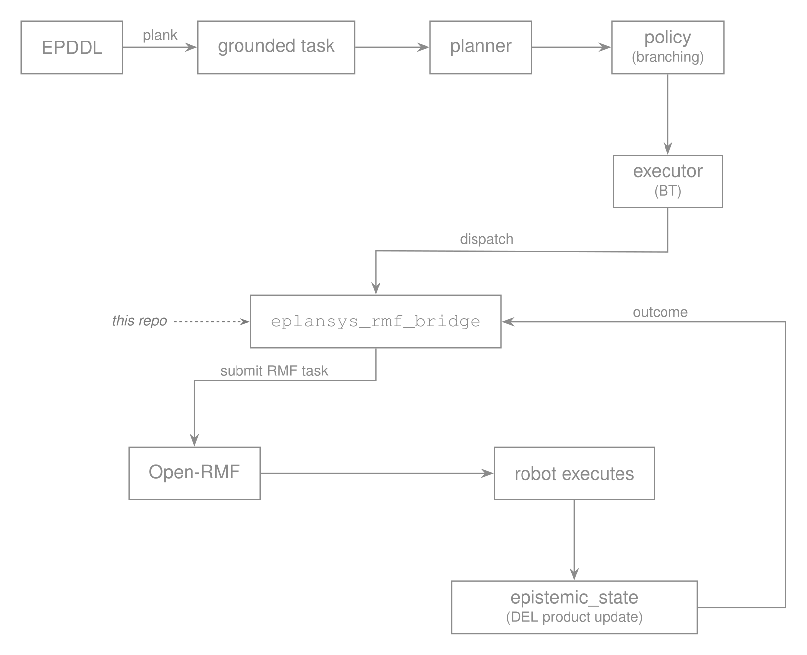

# eplansys-rmf

An Open-RMF execution interface for [ePlanSys](https://github.com/ePlanSys/eplansys).
Epistemic policies are dispatched as fleet-level RMF tasks, and the observations
the robots make while executing them are returned to the epistemic state.

Status: the survey mission runs end to end over the `rmf_demos` office fleet,
in both of its branches.

## Separation from the planning stack

Open-RMF is a substantial dependency. Requiring it from `eplansys` would render
the planning stack unusable for installations that do not operate a fleet. The
bridge is therefore maintained as a separate package, following the arrangement
already used by `plansys2_aletheia_plan_solver` for its external binary.

## Division of responsibility

The two systems decide disjoint things. ePlanSys determines what has to be
found out, which agent should act, and which agents may come to know the result.
Open-RMF determines the allocation of floor space, lifts and doors, and which
robot is available to perform the work.

Neither system covers the other's domain. Open-RMF holds no representation of
knowledge, and ePlanSys holds no representation of shared physical resources.
The bridge supplies the interface between them.

## Architecture

<p align="center">
  
</p>

The bridge is an `ActionExecutorClient`. It accepts a dispatched action, submits
the corresponding RMF task, waits for completion, and calls `finish()` with the
outcome the robot observed. `plansys2_msgs/ActionExecution` provides an
`outcome` field for this purpose, on which the policy branches.

## Decisions

### 1. Allocation authority

Both systems perform allocation, and their decisions need not coincide. The
planner assigns actions to named agents during search, and the epistemic model
records knowledge against those names. The RMF dispatcher receives bids and
selects a robot. Where the two selections differ, the model records that an
agent knows something it never sensed, and no error is raised.

**Pinned.** The bridge binds each RMF task to the robot the planner named,
through the `agents` table of its task map. The mechanism is
`robot_task_request`, which carries a fleet and a robot and is handled directly
by that robot's own `TaskManager` without a bid. RMF's traffic management,
lifts and doors are retained in full; only its allocation is forgone.

An agent bound to no robot is a hard error, and the bridge says so and refuses
the action. The alternative, letting RMF choose, is precisely the failure this
decision exists to prevent.

The role-based scheme, in which the planner reasons over abstract agents and
the bridge relabels the epistemic agent after dispatch, remains the research
variant. Relabelling an agent in a Kripke model during execution is not a
trivial operation.

### 2. Outcome transport

Settled by reading the sources, since Open-RMF's own documentation does not
address it: **a task carries no result payload.**

`rmf_api_msgs`' `task_state.json` has no result, return or output property at
any level, and its completion-bearing fields are a `status` token from a fixed
enumeration and a finish time.
`RobotUpdateHandle::ActionExecution::finished()` takes no argument, which is
the exact API a performer would report through. The newer `DynamicEvent`
action result carries a failure string, a status string and an event id, and
nothing of the domain.

Two free-form fields do travel with a task, and the bridge reads both:

- an event's `detail` string, set through `SimpleEventState::update_detail`
  and forwarded verbatim into every state update;
- log entries, which a performer writes through `underway()` and its
  neighbours.

A value carrying the prefix `eplansys.outcome=` in either is read as the token
the policy branches on. The log route is the one reachable from an ordinary
`perform_action` callback; `detail` is tidier and needs a custom
`rmf_task_sequence` event.

On Humble this stream leaves the fleet adapter over the websocket named by the
adapter's `server_uri` parameter and over nothing else. `StandardNames.hpp`
declares only `task_api_requests` and `task_api_responses`; the ROS 2 mirror of
`task_state_update` and `task_log_update` exists on rolling and not here. So
the bridge is the websocket server the adapter dials.

### 3. Action to task mapping

**A separate file**, keyed differently.

`eplansys`'s `action_mapping.json` maps plank's grounded names to PlanSys2
action expressions, and does its work inside the planner. By the time an action
reaches a performer the grounded name is gone and what remains is a name and
arguments, so a map keyed on grounded names could not be consulted here. The
two files answer different questions at different times, and collapsing them
would mean the bridge could not look anything up.

The bridge's map binds agents to robots and says where each action sends one.
`eplansys_rmf_demo/config/office_survey.json` is the worked example.

## Packages

| package | contents |
| --- | --- |
| `eplansys_rmf_bridge` | the `ActionExecutorClient` that submits RMF tasks |
| `eplansys_rmf_demo` | the survey mission over an RMF fleet |
| `eplansys_rmf_probe` | diagnostics: submit one task, and watch what returns |

## Reference scenario

The target scenario is the survey domain of `eplansys`. It comprises three
robots and a site that may be contaminated, under a goal of three conjuncts.
The scout is required to find out whether the site is contaminated, the relay is
required to come to know the result, and an observer is required not to. The
planner declines to broadcast and uses a private channel instead, since
broadcasting would falsify the third conjunct.

Executing this domain over an RMF fleet, with RMF driving the robots,
constitutes the intended demonstration of the bridge.

## Running it

```
ros2 launch eplansys_rmf_demo survey_rmf_launch.py
ros2 launch eplansys_rmf_demo survey_rmf_launch.py site:=clean
```

One command brings up the office fleet, the planning system and the bridge.
`site:` chooses what the scout turns out to find, and the policy takes a
different branch for each: `relay-dirty_relay_scout` against
`relay-clean_relay_scout`, with the robot driven by RMF either way.

`rmf:=false` leaves the fleet to another terminal, and `headless:=true` runs
Gazebo without a window.

## Building

`eplansys_rmf_bridge` looks for plansys2 with `QUIET` and builds its library
without it, so the RMF half compiles and its tests run on a machine that has
Open-RMF and no `eplansys`. The performers need both.

```
sudo apt install ros-humble-rmf-dev libwebsocketpp-dev libboost-system-dev
colcon build
```

`rmf_demos` is not released into Humble and has to be built from source for
the demo; its `humble` branch is the one to use.

## Dependencies

- ROS 2 Humble or Rolling
- [eplansys](https://github.com/ePlanSys/eplansys)
- [Open-RMF](https://github.com/open-rmf)

## Contributing

The tree follows the ament default style rather than Open-RMF's, and the CI
lint job is reproducible locally in three commands. See
[CONTRIBUTING.md](CONTRIBUTING.md).

## Licence

Apache-2.0